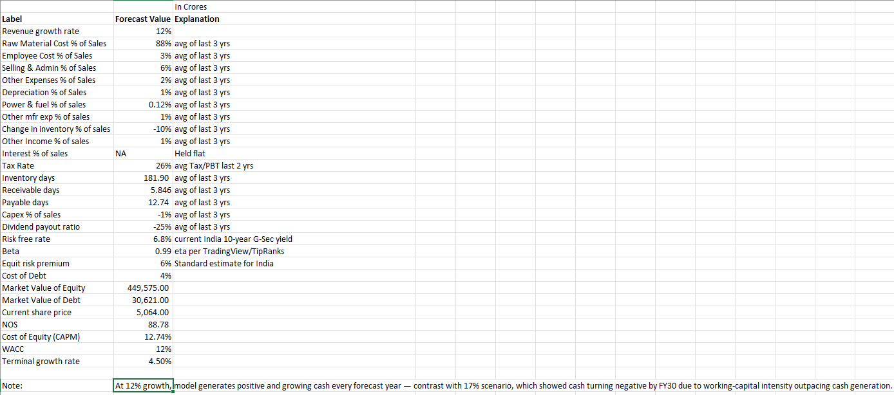
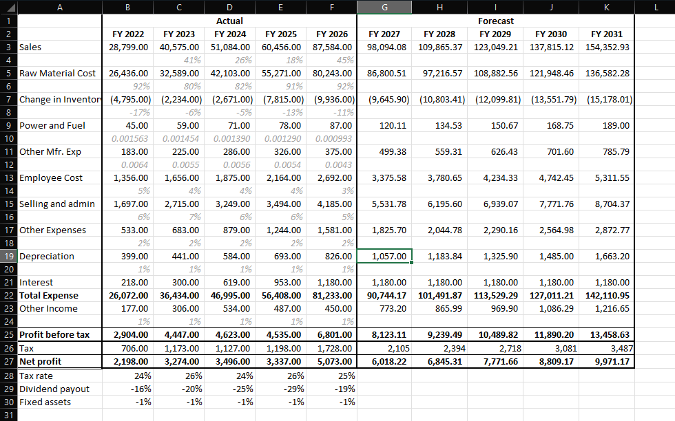
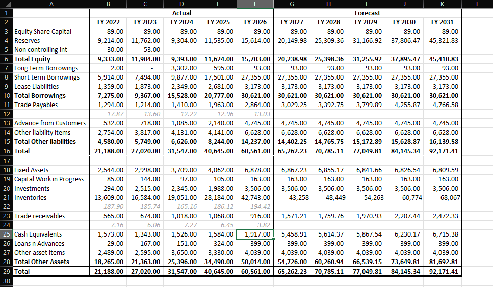
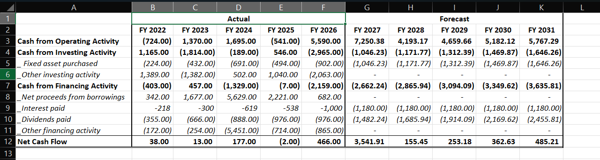

# Titan Company Ltd — 3-Statement Financial Model & DCF Valuation

A fully linked Income Statement, Balance Sheet, and Cash Flow Statement, built from Titan Company's historical financials (FY22–FY26), projected forward 5 years (FY27–FY31), and used to derive an intrinsic valuation via Discounted Cash Flow.

## Overview

This model was built to demonstrate core financial modeling skills — historical analysis, driver-based projections, three-statement linkage, and DCF valuation — using a real, publicly listed Indian company (Titan Company Ltd., NSE: TITAN).

**Tools used:** Microsoft Excel
**Data source:** Screener.in, Titan Company's published financial statements

## Model Structure

| Tab | Contents |
|---|---|
| `Assumptions` | All forecast drivers in one place — growth rate, cost ratios, working capital days, WACC inputs |
| `Income Statement` | 5-year historical + 5-year forecast, driven by %-of-Sales assumptions |
| `Balance Sheet` | 5-year historical + 5-year forecast, working capital driven by Days-based assumptions |
| `Cash Flow` | Fully derived from Income Statement + Balance Sheet changes (Operating), plus Investing and Financing activity |
| `DCF` | Unlevered FCFF build, CAPM-based WACC, Gordon Growth terminal value, implied share price |

## Methodology

- **Revenue & cost projections**: driven by historical 3-year average % of Sales for each cost line
- **Working capital**: Inventory, Receivables, and Payables projected using Days-based ratios (Days × relevant driver ÷ 365), not flat % of Sales — a more precise, standard technique
- **Balance sheet linkage**: Reserves roll forward as Prior Reserves + Net Profit − Dividends Paid; Cash is the final plug, derived entirely from the Cash Flow Statement — never hardcoded
- **DCF**: Unlevered Free Cash Flow (FCFF) = NOPAT + D&A − Capex − Increase in Net Working Capital, discounted at WACC (CAPM-derived Cost of Equity + after-tax Cost of Debt, weighted by market value), with Gordon Growth terminal value

## Key Findings

- **Model validation**: Balance Sheet ties exactly (Assets = Liabilities + Equity) across all 5 forecast years — confirming the three statements are correctly linked.
- **Growth sensitivity**: At an aggressive 17% revenue growth assumption, the model shows cash turning negative by FY30, driven by working capital (particularly ~180+ days of inventory, typical for a gold/jewelry-heavy business) outpacing cash generation. At a more moderate 12% growth assumption, cash remains positive and growing throughout the forecast — illustrating how sensitive high-growth retail/jewelry businesses are to working capital intensity.
- **DCF vs. market price**: The DCF (at 12% growth) implies a per-share value materially below Titan's actual market price. This reflects a known limitation of single-stage DCF applied to high-multiple growth/luxury names — the market is pricing in sustained long-term growth and multiple expansion beyond what a 5-year explicit forecast + terminal value can capture, not a flaw in the model's construction.

## Limitations

- Interest expense held flat in the forecast (no full debt schedule/amortization built)
- Fixed Assets projected via a simplified Capex−Depreciation roll-forward, not a detailed asset schedule
- Single-stage DCF (Gordon Growth terminal value) — does not incorporate a multi-stage growth fade or explicit terminal-year normalization
- Beta and risk-free rate are point-in-time market inputs and will drift over time

## Author

Jaskirat Singh
[LinkedIn](https://www.linkedin.com/in/-jaskiratsingh-/)
